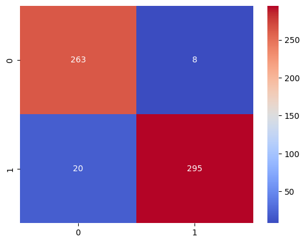
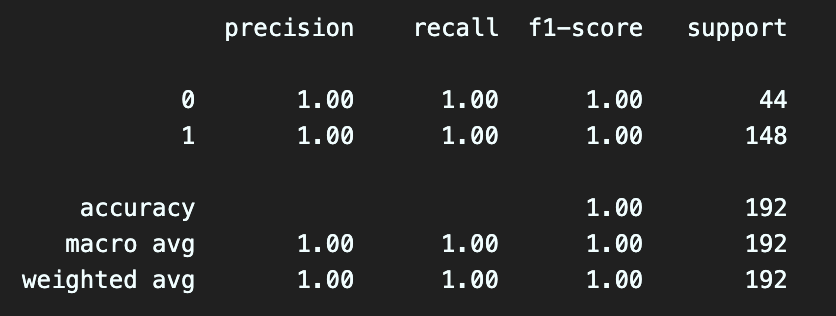
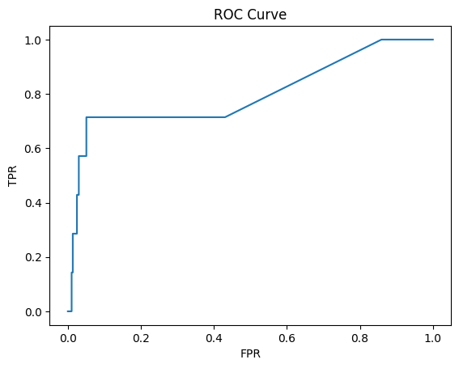

**Spam Classifier for YouTube Comments**

**202310603 Hyunjoon Kim (김현준)**

Abstract

Throughout the world of internet, classifying spam contents has become
one of the crucial features for website owners. YouTube is one of the
biggest platforms not only guarantees the accessibility of leaving
comments to the users, but also watching other's comments. It refers
that it is a juicy prey for someone running a business which is harmless
or harmful for others. This paper covers YouTube's real time comments
collection using YouTube Data API, and comments ham or spam
classification using machine learning technique. Using Random Forest
machine learning technique, the model detected some spam comments.

Introduction

YouTube is the biggest video sharing platform that allows users to leave
their thoughts, ideas, or emotions. However, unlike the average users,
there are distinctively harmful comments for their profit that could
distract the average users. Based on that, managing advertisements or
scam contents on comment section is one of the crucial tasks for keeping
the number of users and their income. Indeed, YouTube, one of the
largest video platforms, is well managing the spam contents by using its
classification model and tremendous amount of data. However, for the
companies that are small, collecting that amount of data might be
impossible. Moreover, with the lack of computing systems, building and
training a model could be competitive to the spam classifier from
YouTube would be in the dream for them. A solution for that is building
small and compact model that could not be the best but works well for
too obvious spam contents.

For classification model, building a neural network model is one of the
cases. However, for this paper, I focused on simple machine learning
techniques. The reason for that is I want this classifier could be an
initial solution, and the owner would be able to develop it afterward,
based on the result of this classifier.

Firstly, I used basic spam classification dataset from Kaggle. With that
dataset, we would like to be able to train the model the basic format of
spam content. Also, I used AI-generated Gen-Z slang comments dataset
from Chat-GPT so that model will be able to recognize the slangs from
recently written comments. For the preprocessing of the dataset, I used
Porter's Stemmer for stemming and TF-IDF Vectorizer for vectorization.
Next, for the model, I used Random Forest (RF) Classification model. RF
is a machine learning technique uses ensemble method that combines
multiple base models to make the high accuracy and precise predictions.
Especially for spam content classification, it is one of the recommended
solutions.

2\. Related Works

For spam detection, plenteous amount of research papers, projects and
studies exist using machine learning techniques regardless of platform.
Spam email detection using machine learning on Medium,Same method on
GitHub, and SMS spam detection on Kaggle. That means spam detection is a
hot topic, and it is crucial and valuable for people.

3\. Proposed Methods

For classifying spam comments, Naïve Bayes is one of the suitable but
also popular methods. However, Based on the test results from [Spam
detection for YouTube video comments using machine learning
approaches](https://www.sciencedirect.com/science/article/pii/S2666827024000264#sec1),
it is showing that Random Forest showed the highest F1-score recorded
0.962... . Whereas Naïve Bayes method showed lowest accuracy score
recorded 0.852... . Therefore, I thought using a Random Forest solution
would be highly recommended for spam detection. To classify the natural
language, the human language in the other words, vectorizing method must
be presumed. Thus, for the vectorizing method, there are several methods
such as Bag of Words, Tf-Idf, and Word2Vec. For this project, I thought
Word2Vec method is too sophisticated, and Tf-idf vectorizing method
should be precisely work for spam detection. Since we are counting the
frequencies of the words, removing grammatical part of the word and
leaving the stem of the words would work effectively. For this effective
method, I used Porter\'s Stemming algorithm, which is the well known
stemming method. Lastly, for the evaluation method, I chose F1-score.
F1-score includes Precision score and Recall score for calculation,
which fits for binary classification methods.

3.1. Stemming Algorithm

Stemming is a method for processing text-based data by eliminating
prefixes and suffixes so that the model only interprets the fundamental
part of the word. In simple word, it is clensing grammars from words. I
chose Porter's Stemmer for the project, one of the most popular stemming
algorithms proposed in 1980. Example of Porter's Stemmer is this.
Suppose we have *'running'*, *'jumps'*, *'happily'*, and *'running'* as
original words. After stemming those words, those will turn to *'run'*,
*'jump'*, *'happili'*, and *'run'*. That will make difference in terms
of calculating frequency in vectorization term.

3.2. Vectorization of Comments Using *TF-Idf Vectorizer*

*TF-Idf Vectorizer*, a vectorizing method for natural languages which is
based on frequency, in other words, it is counting how many sentences
are including a certain word. TF-IDF Vectorizer is an advanced method of
Bag of Words, and the difference between those two methods is that
*TF-Idf vectorizer* excludes the conjunctions such as preposition or
article, so that we could ignore the most frequently used words
regardless with the intension of the sentences. That means it is
appropriate for spam classification detecting model.\
*Tf-Idf vectorizer* shows its calculation by its name, which is:

$$TF\ IDF = Term\ Frequency\ *log(\ \frac{number\ of\ Document}{Document\ Frequency\ })$$

*TF,* which stands for *Term Frequency*, is a vector of counted words
how many times showed in a certain sentence. Suppose we have a sentence
*"banana apple apple orange."*. If it is the only sentence in the
dataset, Term Frequency of this sentence is going to be

$$TF\ of\ 1st\ Document = (1,\ 2,1)\ $$

Meaning that except the word *'apple'*, the other words have shown only
once in the example sentence.

Suppose that we have more sentences *"apple carrot eggplant carrot" and
"banana mango orange orange"*. In this case, the new words are going to
be stored last in the vector, and the words already exist inside of TF
will add the number of its position. *\
*$$Vocabulary = (2,3,3,2,1,1)$$

$$TF\ of\ 2nd\ Sentence = (0,1,0,2,1)$$

$$TF\ of\ 3rd\ Sentence = (1,0,2,0,0,1)$$

As we can see Vocabulary, the words *'apple'* and *'orange'* is showing
high frequency compared to the other words. Let's suppose the 2^nd^
Sentence is a spam comment. If we give these vectors, classifier would
likely be confused, because there is not any distinctive difference.
which are going to be conjunctions and article etc. in real life. To
solve this problem, IDF which stands for Inversed Document Frequency is
required.

DF counts how many sentences included the certain word. For instance,
the vector of DF is going to be *\
*$$DF = (2,2,2,1,1,1)$$

High values inside of DF inherent that it has a possibility that it is a
conjunction or article etc. Now, since the values in DF must be inversed
so that model could ignore the high values inside of DF. In conclusion,
applying it to an equation, the final vectors are going to be

$$IDF = \ \frac{number\ of\ Document}{DF}\  = (1.5,1.5,1.5,3,3,3)$$

$$TF*IDF\ of\ 1st\ Sentence = (1.5,\ 4.5,\ 1.5,\ 0,\ 0,\ 0)$$

$$TF*IDF\ of\ 2nd\ Sentence = (0,\ 1.5,\ 0,\ 6,\ 3,\ 0)$$

$$TF*IDF\ of\ 3rd\ Sentence = (0.5,\ 0,\ 3,\ 0,\ 0,\ 3)$$

After calculating TF-IDF, compare to TF vectors, since we supposed that
the 2^nd^ sentence is the spam, model will give a high score if the new
sentence contains the word *'carrot'* and *'eggplant'*.

3.3. Classifying Spam Comments by Using Machine Learning Method

For classification method. As I mentioned at 3., I chose RF
classification method which showed highest result among the
classification methods. Random Forest leverages the strength of decision
trees and ensemble learning. By constructing multiple trees, each
trained on different subsets of the data, and aggregating their
predictions through averaging, Random Forest mitigates the over-fitting
of individual trees.

3.4. Evaluation of Spam Comment Classifier

In binary classification, results are divided True Positive (TP), True
Negative (TN), False Positive (FP), False Negative (FN). With each
result, calculating score of the model such as 'F1-Score', 'Precision
Score' or 'Accuracy' would be calculated by those values. For spam
classification, I thought both precision score and recall score are
crucial for spam detection. Therefore, I chose F1-score as an evaluation
method for my model. F1-score calculates harmonic mean between Precision
Score and Recall Score.

4\. Experiment and Result Analysis

For implementation, I chose 2 datasets from Kaggle and AI to train the
model. A dataset from Kaggle highly used for basic Natural Language
Process (NLP), but the comments consisting of the dataset are outdated.
To classify recent comment data, I decided to use AI generated dataset
that contains slangs. With that solution, the model would be able to
classify the slangs in the comments.

4.1. Dataset

Datasets are formed in data table having two columns, Comment and Class.
The dataset from Kaggle had 1956 rows, and well distributed class as we
can see in Fig1.

{width="3.239346019247594in"
height="2.535515091863517in"}

Fig 1. Class Distribution of dataset from Kaggle.

Meanwhile, for AI generated Dataset, I used
[prompt](https://chatgpt.com/share/674d7142-da30-8000-89ea-f4ced7c6b562)
below this sentence to get a dataset.

*"**User :***

*could you make a 1,000 of Youtube comment data which has 2020-2024\'s
slangs for spam binary classification? dataset must be look like this*

*\`\`\`csv*

*comments,class*

*\`\`\`*

*If the comment has the link, please generate the link by your self.
Make sure all the comments are unique in the dataset"*

Even though I got the dataset looks fine, I had to exclude the numerous
duplicated ham comments from dataset. As a result for that, I got
imbalanced dataset. However, since we are using RF algorithm which takes
subsets from the dataset, it would not be a crucial problem.

{width="3.9583333333333335in"
height="3.1527777777777777in"}

Fig2. Class distribution of AI generated Dataset

4.2 Training & Testing the Model

To choose the hyper parameters for both TF-IDF vectorizer and RF
Classifier, I decided to use cross validation method so that I could
save tons of time. I used [Randomized Cross
Validation](https://scikit-learn.org/1.5/modules/generated/sklearn.model_selection.RandomizedSearchCV.html)
since we are using numerous amounts of dataset for training. Cross
validation method is iterating the possible parameter settings given by
user. For the parameters of [TF-IDF
vectorizer](https://scikit-learn.org/1.5/modules/generated/sklearn.feature_extraction.text.TfidfVectorizer.html),
I chose *'lowercase'*, *'max_df'*, *'max_features'*, and *'min_df'*.
Also, for [RF
classifier](https://scikit-learn.org/1.5/modules/generated/sklearn.ensemble.RandomForestClassifier.html),
I chose *'max_depth'*, *'max_features'*, and *'n_estimators'*. The
explanation for these hyper parameters is on *Scikit-learn*
documentation. Through this cross validation, I got 0.95 for f1-score on
Kaggle dataset, 1.0 for AI generated dataset.

{width="6.5in"
height="1.9097222222222223in"}

Fig 3. Model Diagram for Kaggle Dataset

{width="3.13797353455818in"
height="2.4958398950131233in"} {width="3.112062554680665in"
height="2.475232939632546in"}

Fig 4, 5. Confusion Matrix for Kaggle Dataset(left), AI generated
Dataset(right)

{width="5.805555555555555in"
height="2.1944444444444446in"}

Fig 6. Classification Report for Kaggle Dataset

{width="5.805555555555555in"
height="2.1944444444444446in"}

Fig 7. Classification Report for AI generated dataset

{width="3.13744094488189in"
height="2.5166054243219595in"}{width="3.091771653543307in"
height="2.4799715660542434in"}

Fig 8, 9. F1 Score of each Thresholds and ROC curve for Kaggle
Dataset(left) and AI generated Dataset(right)

4.3 Application to Real YouTube Comments

Good model works for real data. For this case, grabbing real comments
from YouTube and classifying with the model would be the precise
validation for our model. Unfortunately, spam comments classified by
YouTube are not allowed because of the
[policy](https://developers.google.com/youtube/v3/docs/comments/markAsSpam).
However, recent comments imply possibility that those are not blocked
yet. Fortunately, [YouTube Data
API](https://developers.google.com/youtube/v3/docs/commentThreads/list)
provides the example of use which is written in various programming
languages that they support, including python. With that code, I wrote a
function calls an API and returns the list of comments. For the next
step, I marked a thousand of comments. However, only 7 comments were
spam in my perspective, and the purposes of the comments marked spam
were ambitious. Before the test, I concatenated Kaggle Dataset and AI
Generated Dataset. {width="6.5in"
height="1.8958333333333333in"}

Fig 10. Model Diagram for concatenated dataset

{width="5.555555555555555in"
height="2.0972222222222223in"}

Fig 11. Classification Report for concatenated dataset

{width="3.0781102362204726in"
height="2.4482272528433944in"}{width="3.070813648293963in"
height="2.4631616360454944in"}

Fig 12, 13. Confusion Matrix (left) ROC Curve (right) for concatenated
dataset

As we can see the result, the model recorded low F1-score of classifying
spam comments. However, it was working properly for 4 spam comments. I
will leave the four comments below this sentence.

*"Glorilla continues to release incredible music! Sexy Red also appeared
in HAM! After they discovered the SHORT on my channel describing how all
of those artists are currently becoming so successful, they both
significantly advanced in their professions."*

*"\"The song 🗿\\nThe creator 🗿\\nThe instrumental 🗿\\nThe viewers
🗿\\nThe song listener🗿\\nThe saver of the song🗿\\nThe one who added
this song in his playlist 🗿\\nThe one*

*... (repeating) ...*

*writing this🗿\\nThose who have the hearing ability to listen to this
song🗿\\nGuys it takes alot of time pls subscribe to me 😢😢and like me
😢*

*If u find my comments subscribe to me\"*

*"Please pin me! These are one of my favorite videos to watch! They make
me laugh! 😊\'"*

*\"Hello, I was wondering, if I can share with you the most important
thing. God the Father sent His holy Son Jesus to earth, to be born of a
virgin.*

*... (religious content) ...*

*We all must sincerely receive Jesus into our life to be God\'s child.
See John 1:12 for this please. Will you today genuinely by faith receive
Jesus into your life for salvation?"*

4.4. Analyzing the Result

Even though it was not quite a successful result, because of its
purpose, for small companies that are not affordable for high
computation for training, It is an appropriate model. Firstly, the time
recorded 50.2 second to train the concated dataset for my local
environment(Macbook M3 Pro). For small companies, I would like to say
that it is affordable time to train that they could wait for. Second of
all, this model is affordable. To use other's spam classification model,
according to [OOPSpam](https://www.oopspam.com/#pricing), it costs \$40
per month for 100,000 of API call. However, for someone who is trying to
open their new websites, it is a hard decision to buy an API for spam
detection. Lastly, it works. Even though it is not a perfect model, it
did detect some comments with passing most of the ham comments. Also,
training time was also nearly a minute, that means we can improve the
model with collecting more data while running the service. In
conclusion, the model didn't record high accuracy, but it must be
suitable for individuals.

5\. Conclusion

For this Learning Concert, I made spam detector for YouTube comments,
and I focused on making it for the small companies. As a result, I got
the model with 0.96 and 0.97 of predicting test comments and real ham
comments. However, the model was recording 0.13 f1-score for the spam
contents. Even though it is not a great model, given its computation
time and working fine for ham contents, it is true that it would like to
be applied for small company's website or programs.

6\. References

\[1\] [Email Spam Detection with Machine Learning: A Comprehensive
Guide](https://medium.com/@azimkhan8018/email-spam-detection-with-machine-learning-a-comprehensive-guide-b65c6936678b)
by Azim Khan

\[2\] [Email Spam Detection using Machine
Learning](https://github.com/kanagalingamsm/Email-Spam-Detection) by
Kangalingamsm

\[3\] [Spam detection for Youtube video comments using machine learning
approaches](https://www.sciencedirect.com/science/article/pii/S2666827024000264#sec1)
by Andrew S. Xiao a, Qilian Liang b

\[4\] [The Porter Stemming
Algorithm](https://tartarus.org/martin/PorterStemmer/) by Martin Porter

\[5\] [Randomized CV in
SKlearn](https://scikit-learn.org/1.5/modules/generated/sklearn.model_selection.RandomizedSearchCV.html)

\[6\] [TF-IDF in
SKlearn](https://scikit-learn.org/1.5/modules/generated/sklearn.feature_extraction.text.TfidfVectorizer.html)

\[7\] [Random Forest Classifier in
SKlearn](https://scikit-learn.org/1.5/modules/generated/sklearn.feature_extraction.text.TfidfVectorizer.html)

\[8\] [YouTube Data
API](https://scikit-learn.org/1.5/modules/generated/sklearn.feature_extraction.text.TfidfVectorizer.html)
in Google Cloud API Service

\[9\] [OOPSpam](https://www.oopspam.com/#pricing)
